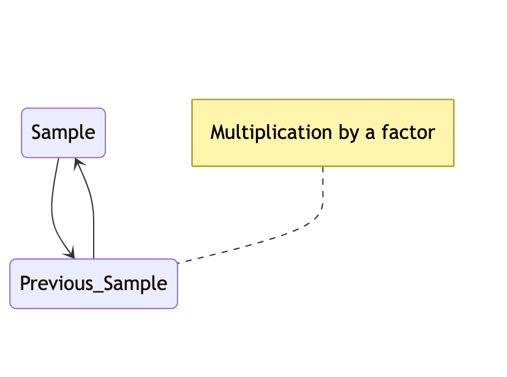
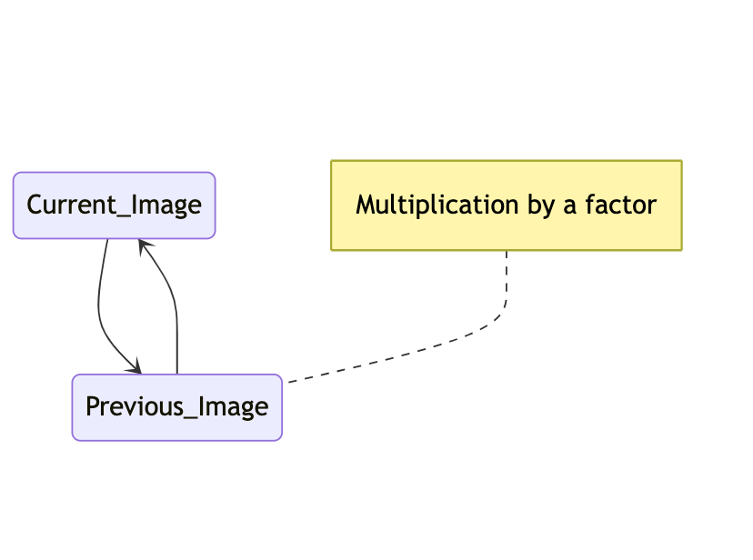
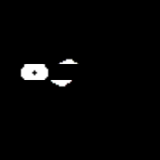

# Rolling Feedback

## Feedback

When you feed any output back to the input you get feedback. 

### Feedback on audio data

In world of audio this can create a lot of different effects. \
To keep this processing stable feedback factor, the factor that you scale your data with \
should be < 1 and bigger > -1. If your feedback amount is too big then your processing might becomes instable and you  end up blowing up your speakers or even your ears. 

### Feedback on image data
When using feedback processing on images you actually don't hear results you only \
see them. So you basically can use bigger factors but in most cases it will end up in \
a black or a white image. 

This is an example on how it can look:

## Rolling

Numpy has a interesting function called [np.roll](https://numpy.org/doc/stable/reference/generated/numpy.roll.html). By "rolling" a section of an image you get: 

## Rolling Feedback
Putting these two processing methods togheter you can create a "rolling feedback":

<b> with negative feedback coefficient</b>
 

<b> with positive feedback coefficient</b>
 

## References
[Feedback Filters](https://www.analog.com/en/lp/001/beginners-guide-to-dsp.html)
