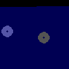

# Comb Filter

## Delay

As soon as data gets on a virtual device it is somehow finite. \
Like having a list containing your data. As soon as it has some index or a duration \
you can read that data after a duration. 

## Delay on audio data

Audio data is sampled. That means you take data and you "map" it to a finite set of points. These points \
are called samples. As soon as you have a finite set of points basically you can say I want to read them after some "time" or samples.
A delay can work like this. I insert "0" at beginning of my samples. Amount of these "0" are amount of delay. 
Then I just start reading my list of samples form beginning.

## Combfilters on audio data

Combfilters in signal processing are used for many audio effects. You delay your audio by a time in samples and based on your processing you delay input (feedforward) or output (feedback) or both and add them back to your input. This creates a nice [spectrum](https://en.wikipedia.org/wiki/Comb_filter) 

## Delay on image data

Image data is also sampled. A video contains frames. These frames are images. There is a framerate in each video that are frames a second. 

You can delay a image by one frame. 

## Combfilter on image data

So basically you can apply a combfilter to an image. It is more you treat image data as audio data. Make from image data that is a 2d matrix with different planes a 1d "matrix". Like that image data has same structure as audio data.  Define a delay in samples (audio samples). Apply following processing: 

Reshape your image data in shape of audio data back to a 2d matrix and you can following result:

