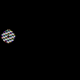

# Ring Modulation

## Ring Modulation on audio data

You can see audio data as a stream of numbers. Numbers can be added, subtracted, multiplied. Basically you can create a signal with synthesis and then apply your stream to another stream. 

## Ring Modulation on image data

By just multiplying a sinusoid with image data you might get following result: 

## References 
[Ring Modulation](https://www.patchwerks.com/blogs/patchnotes/what-is-ring-modulation-frequency-modulation-and-amplitude-modulation)