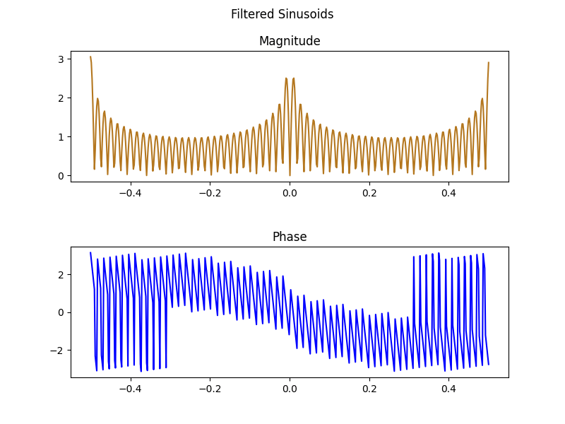

# Leaky LFO

## Filtering audio data

Audio can also be seen as a list of numbers. Like numbers that usually change over time. With numbers you can do calculations. 
Lets say I got some numbers and I delay them and apply some maths on them. Let's say I create a list of numbers. I know what numbers there are. 
Then I apply some maths and I look whats left of my numbers. Usually this is much more complex than this. But it will do.
My list of numbers are a sum of sinusoids. If you know when your filter is stable you can also change it over time. 
In audio you mostly use a low frequency oscillator or some kind of envelope. Like changing your numbers over time. 

## Filtering image data

Image data in 8 bit has values from 0 to 255. Usually 3 or 4 planes. You can see this as a multidimensional list. In most cases first three planes are 
Red, Green and Blue. Last one is [Alpha](https://www.w3.org/TR/PNG-DataRep.html#:~:text=An%20alpha%20channel%2C%20representing%20transparency,represents%20a%20fully%20opaque%20pixel).
If Red, Green and Blue have all the value 0, then you have a black color. When all are 255 then the color is white. 
Let's say you got a list of number containing only 0. Actually by doing multiplication by another number you will end up getting 0. When your list changes or is not only 0 you can do same processing as in audio. A leaky integrator can be seen as a lowpass filter. 

## References 
[LFO](https://en.wikipedia.org/wiki/Low-frequency_oscillation#:~:text=Low%2Dfrequency%20oscillation%20(LFO),as%20vibrato%2C%20tremolo%20and%20phasing)
[Leaky Integrator](https://en.wikipedia.org/wiki/Leaky_integrator) 
[Moving Average Filters](https://www.analog.com/media/en/technical-documentation/dsp-book/dsp_book_ch15.pdf)